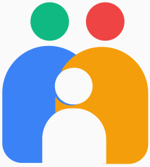

# MiniMeet

MiniMeet is a lightweight, real-time video conferencing web application that allows users to create and join meetings with features like video/audio controls, screen sharing, and real-time chat.



## Features

- **User Authentication**: Secure login and registration system
- **Real-time Video Conferencing**: Connect with multiple participants via WebRTC
- **Audio/Video Controls**: Easily mute/unmute and toggle camera during meetings
- **Screen Sharing**: Share your screen with meeting participants
- **Real-time Chat**: Send and receive messages during meetings
- **Room Management**: Create new meeting rooms or join existing ones with a room code
- **Persistent Chat History**: Chat messages are stored and retrieved when joining a room
- **Responsive Design**: Works on both desktop and mobile devices

## Technology Stack

- **Frontend**: HTML, CSS, JavaScript
- **Backend**: Node.js, Express.js
- **Real-time Communication**: Socket.IO, WebRTC
- **Database**: MongoDB (for user accounts and chat history)
- **Authentication**: Express-session with MongoDB store

## Getting Started

### Prerequisites

- Node.js (v12 or higher)
- MongoDB (v4 or higher)

### Installation

1. Clone the repository:
```bash
git clone https://github.com/abdul99aleem/MiniMeet.git
```

2. Navigate to the project directory:
```bash
cd MiniMeet
```

3. Install dependencies:
```bash
npm install
```

4. Start MongoDB:
```bash
mongod
```

5. Start the application:
```bash
node server.js
```

6. Open your browser and navigate to:
```
http://localhost:5000
```

## Usage

### Creating a Meeting

1. Log in to your account
2. Click on "New Meeting" on the home page
3. Share the generated room code with participants

### Joining a Meeting

1. Log in to your account
2. Enter the room code in the "Enter room code" field
3. Click "Join"

### During a Meeting

- Toggle your microphone with the microphone button
- Toggle your camera with the video button
- Share your screen with the screen sharing button
- Open the chat panel with the chat button
- Leave the meeting with the "Leave Meeting" button

## Demo Accounts

For testing purposes, the following demo accounts are available:

- Username: user1, Password: password1
- Username: user2, Password: password2
- Username: user3, Password: password3

## Project Structure

```
MiniMeet/
├── models/             # MongoDB models
├── public/             # Static assets
│   ├── css/            # Stylesheets
│   ├── images/         # Images and icons
│   └── js/             # Client-side JavaScript
│       ├── home.js     # Home page functionality
│       ├── login.js    # Login page functionality
│       ├── register.js # Registration page functionality
│       └── videocall.js # Video call functionality
├── routes/             # Express routes
├── views/              # HTML templates
│   ├── home.html       # Home page
│   ├── login.html      # Login page
│   ├── register.html   # Registration page
│   └── videocall.html  # Video call page
├── app.js              # Legacy client-side code
├── server.js           # Main server file
└── shared.js           # Shared state between server components
```

## How It Works

1. **Authentication**: Users register and log in to access the application
2. **Room Creation**: A user creates a meeting room with a unique ID
3. **Signaling**: Socket.IO is used for signaling between peers
4. **WebRTC Connection**: Peers establish direct connections for audio/video
5. **Media Streaming**: Audio and video are streamed directly between peers
6. **Chat**: Text messages are sent through Socket.IO and stored in MongoDB

## Browser Compatibility

MiniMeet works best on:
- Google Chrome (latest)
- Mozilla Firefox (latest)
- Microsoft Edge (Chromium-based)
- Safari (latest)

## Future Improvements

- End-to-end encryption
- Recording functionality
- Virtual backgrounds
- Meeting scheduling
- Email notifications
- Breakout rooms

## Contributing

Contributions are welcome! Please feel free to submit a Pull Request.

## License

This project is licensed under the MIT License - see the LICENSE file for details.

---

Created by [Abdul Aleem](https://github.com/abdul99aleem)
